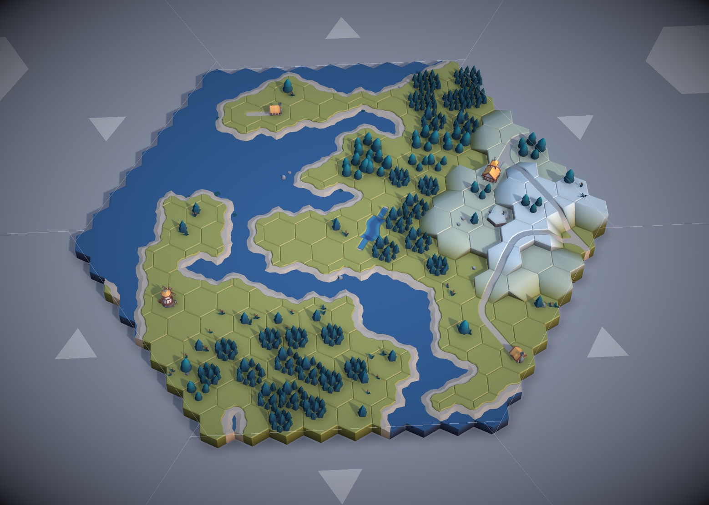

# Hex Map Toy

Generative hex maps with modular wave function collapse.

Built with WebGPU and TSL.

[Live Demo](https://felixturner.github.io/hex-map-wfc/)



## Features

- **Dynamic Shadow Resolution** - Shadow frustum fits camera view, giving crisp shadows when zoomed in.
- modular wave function collapse
- weather
- AO

## Getting Started

```bash
npm install
npm run dev
npm run build
```

## Credits

Asset pack from https://kaylousberg.itch.io/kaykit-medieval-hexagon
